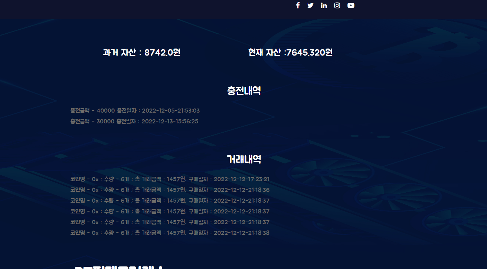

## fastcampus Spring boot 실습 DT핀테크거래소

### 구현해야 할 기능 

#### 회원가입

#### 로그인 기능

#### 충전 기능 

### 거래 하기 

구매하기 누르면 아래 사진처럼 몇 개 구매할건지 입력 할 수 있음

### 거래내역 

로그인을 하면 내가 얼마 충전 했고 얼마나 거래 했는지 자산이 얼마나 있는지도 나온다. 

### 연락 요청하기 기능

### 구독하기 기능 
